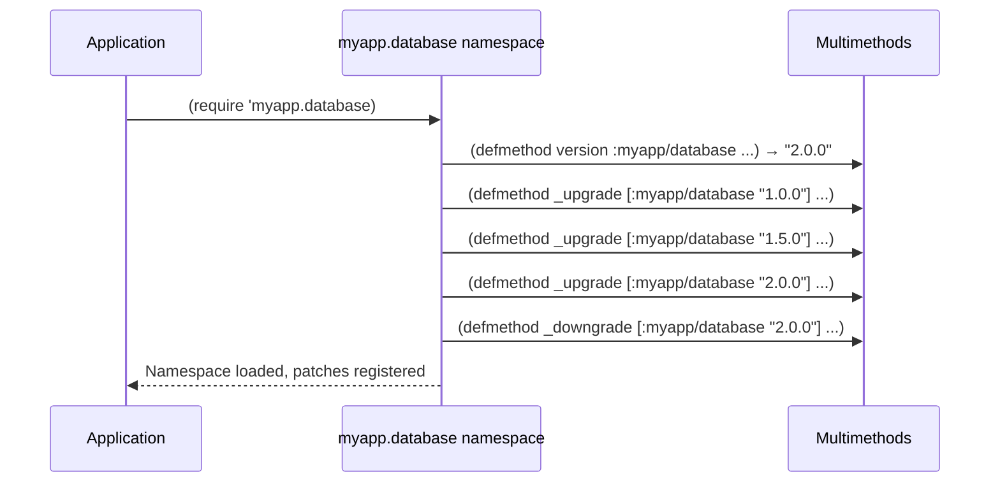
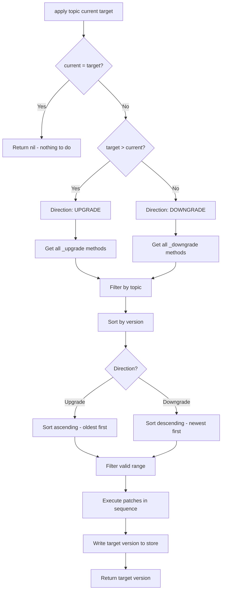
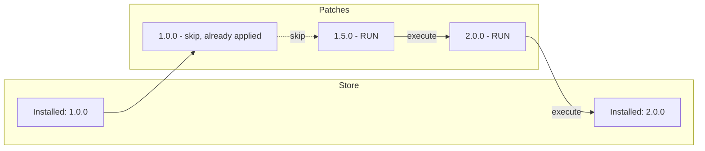
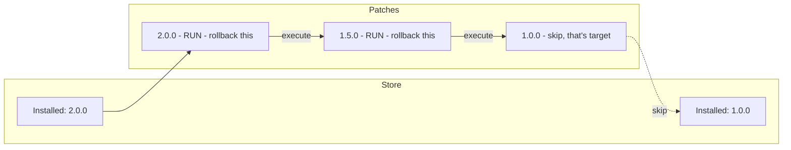
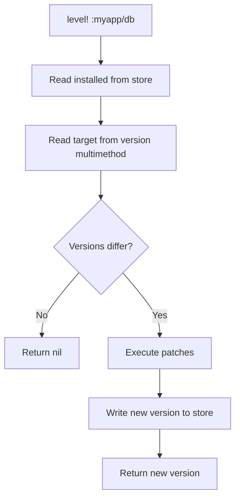
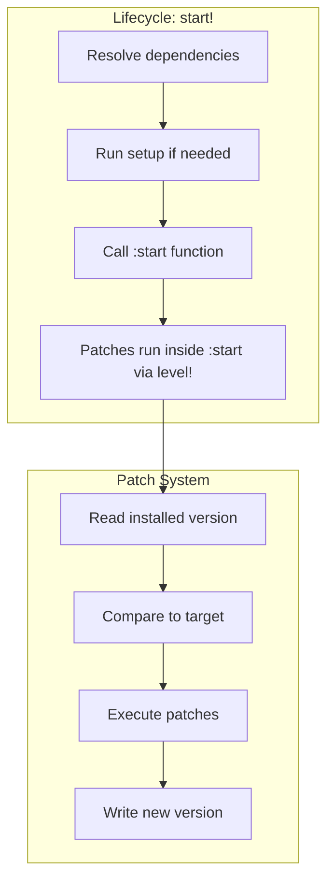

# Patcho Internals

How Patcho works under the hood.

## The Multimethod Registry

Patcho uses Clojure multimethods as a patch registry. When you write:

```clojure
(patch/upgrade :myapp/database "1.0.0"
  (create-tables!))
```

The `upgrade` macro expands to:

```clojure
(defmethod _upgrade [:myapp/database "1.0.0"]
  [_ _]
  (create-tables!))
```

This registers a multimethod implementation that dispatches on the `[topic version]` tuple.

## Registration Happens at Load Time

Patches are registered when namespaces load—not when you call `level!` or `apply`.



This is why patches can live anywhere in your codebase—they just need to be in a namespace that gets loaded before `level!` is called.

## The Three Multimethods

```clojure
;; Target version for a topic
(defmulti version (fn [topic] topic))

;; Upgrade patches: dispatch on [topic version]
(defmulti _upgrade (fn [topic version] [topic version]))

;; Downgrade patches: dispatch on [topic version]
(defmulti _downgrade (fn [topic version] [topic version]))
```

The `methods` function gives you all registered implementations:

```clojure
(methods _upgrade)
;; => {[:myapp/database "1.0.0"] #fn
;;     [:myapp/database "1.5.0"] #fn
;;     [:myapp/database "2.0.0"] #fn
;;     [:myapp/cache "1.0.0"] #fn
;;     ...}
```

This is how Patcho discovers all patches without a separate registry.

## The Apply Algorithm

When you call `(patch/apply topic current target)`:



### Filtering the Valid Range

For **upgrades** (current=1.0.0, target=2.0.0):
- Include patches where: `version > current AND version <= target`
- So patches 1.5.0 and 2.0.0 run, but not 1.0.0 (already applied) or 2.5.0 (beyond target)

For **downgrades** (current=2.0.0, target=1.0.0):
- Include patches where: `version <= current AND version > target`
- So patches 2.0.0 and 1.5.0 run (rolling back), but not 1.0.0 (that's the target state)

### Version Sorting

Patcho uses [version-clj](https://github.com/xsc/version-clj) for semantic version comparison:

```clojure
(require '[version-clj.core :as vrs])

(vrs/older? "1.0.0" "2.0.0")   ;; => true
(vrs/newer? "2.0.0" "1.0.0")   ;; => true
(vrs/older-or-equal? "1.0.0" "1.0.0") ;; => true
```

This allows proper sorting: `1.0.0 < 1.5.0 < 1.10.0 < 2.0.0`

## Upgrade Flow Example

Starting at version 1.0.0, upgrading to 2.0.0:



```clojure
;; Registered patches
(patch/upgrade :myapp/db "1.0.0" (println "1.0.0"))  ; skip - already done
(patch/upgrade :myapp/db "1.5.0" (println "1.5.0"))  ; run
(patch/upgrade :myapp/db "2.0.0" (println "2.0.0"))  ; run

;; Apply
(patch/apply :myapp/db "1.0.0" "2.0.0")
;; Output:
;; 1.5.0
;; 2.0.0
;; => "2.0.0"
```

## Downgrade Flow Example

Starting at version 2.0.0, downgrading to 1.0.0:



```clojure
;; Registered downgrade patches
(patch/downgrade :myapp/db "2.0.0" (println "rollback 2.0.0"))  ; run
(patch/downgrade :myapp/db "1.5.0" (println "rollback 1.5.0"))  ; run
(patch/downgrade :myapp/db "1.0.0" (println "rollback 1.0.0"))  ; skip - target

;; Apply
(patch/apply :myapp/db "2.0.0" "1.0.0")
;; Output:
;; rollback 2.0.0
;; rollback 1.5.0
;; => "1.0.0"
```

## The level! Shortcut

`level!` is syntactic sugar that reads the installed version from the store:

```clojure
(defn level! [topic]
  (let [current (deployed-version topic)  ; read from *version-store*
        target (version topic)]            ; read from multimethod
    (when (not= current target)
      (apply topic current target))))
```

This is the typical entry point—you don't specify versions, Patcho figures it out.

## Store Integration

After patches execute successfully, the new version is persisted:



The store is pluggable via the `VersionStore` protocol:

```clojure
(defprotocol VersionStore
  (read-version [this topic])
  (write-version [this topic version]))
```

## Lifecycle Integration

The lifecycle system (`patcho.lifecycle`) is separate but complementary:



Lifecycle handles *when* things run (dependency order, setup vs start).
Patches handle *what version* things are at (migrations).

## Why Multimethods?

1. **No separate registry** - Clojure tracks methods for you via `(methods multimethod)`
2. **Namespace-distributed** - Patches can live anywhere, loaded when namespace loads
3. **Idiomatic** - Standard Clojure mechanism, no custom data structures
4. **Discoverable** - `(keys (methods _upgrade))` shows all registered patches

The tradeoff: you can't "unregister" a patch at runtime. But patches are definitional—they describe your version history. You wouldn't want to unregister them anyway.
